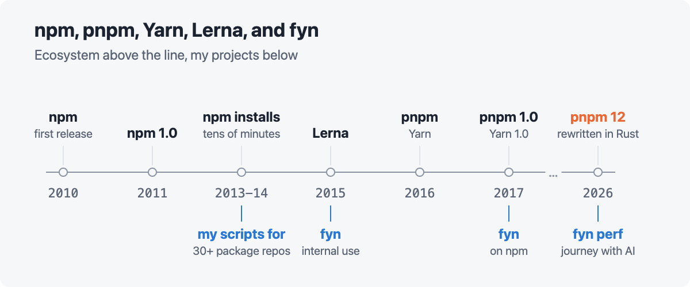
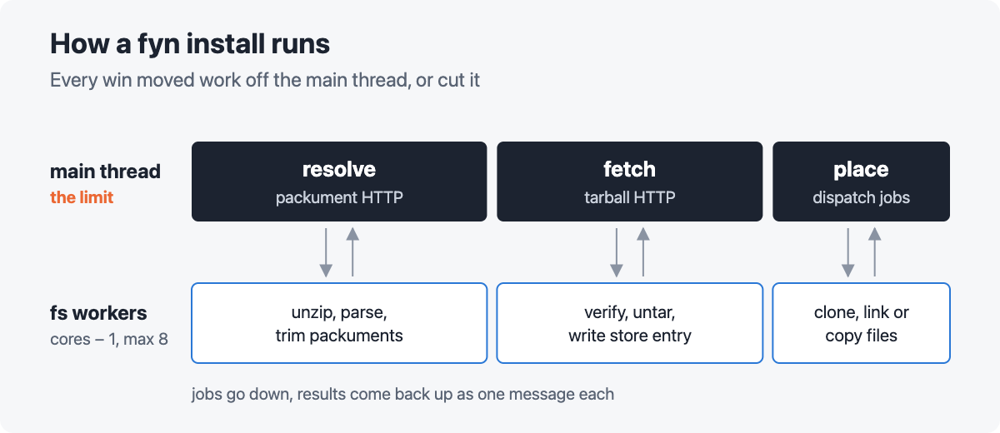
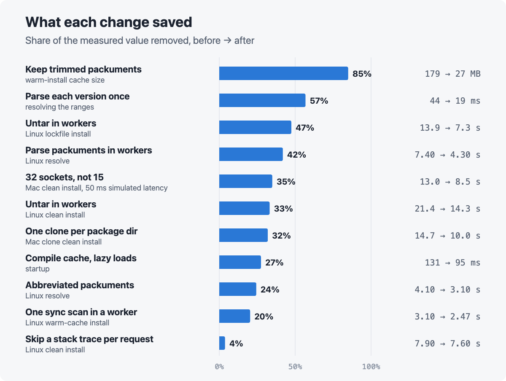
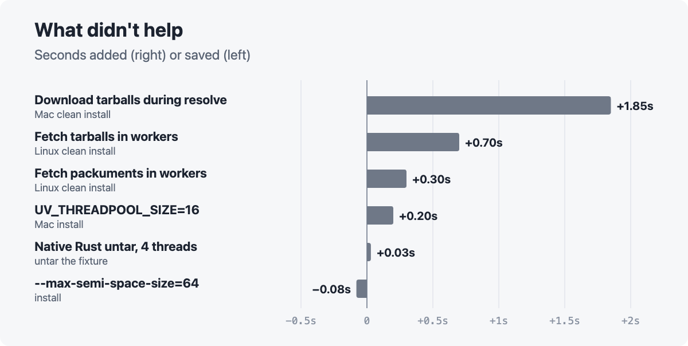
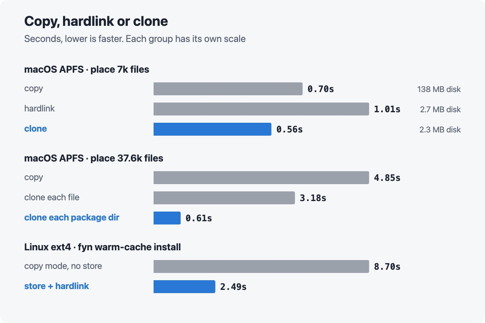
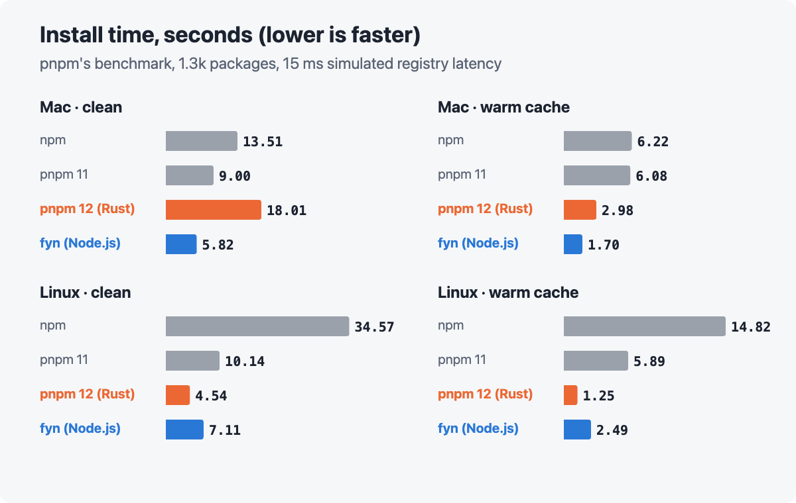
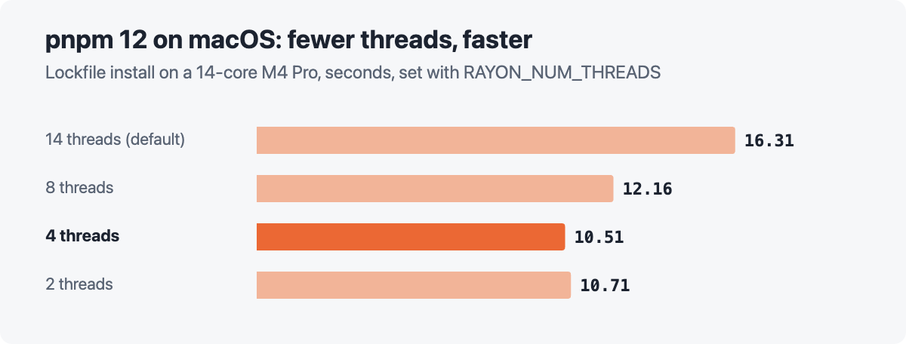
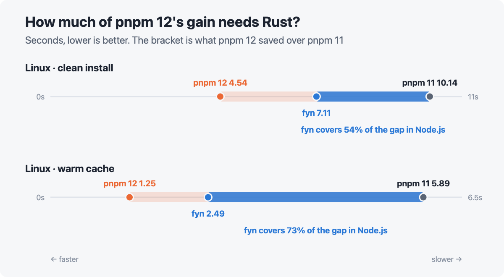
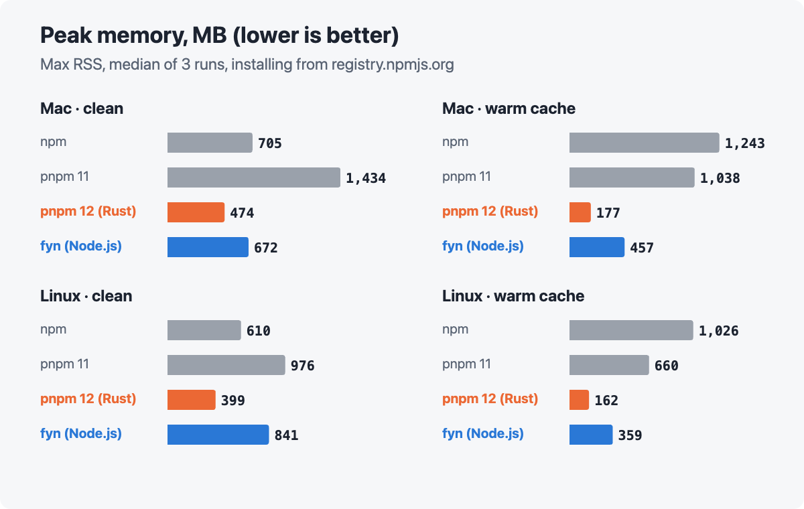

# Rust vs Node.js for a package manager - tuning fyn on pnpm benchmarks

*fyn · pnpm's benchmark · 2026*

Recently I caught the news that pnpm was rewritten in Rust, and I checked it out. It also stirred
my interest in an old project of mine: [fyn and fynpo](https://fynjs.pages.dev/).

**While Rust definitely makes the most of memory, concurrency, and CPU, it's not as clear cut as it may seem. There are some unexpected surprises. Read on to find out.**

## Background

My involvement with Node.js and its package managers goes way back. Here's a quick timeline and
some backstory.

Back before Yarn, npm was notorious for installs that took tens of minutes. I was deep in
Node.js development then, and I had to track more than 30 npm packages in separate repos. Before
Lerna appeared, I experimented with scripts to manage them locally. As those scripts evolved, I
needed control over the internals of npm installs. So I started my own package manager, which
became fyn and fynpo.

pnpm appeared around the same time. Then Yarn came out and took the space by storm.

Over the years I kept improving fyn and fynpo for my own projects. They mostly meet my needs, so I
spend less time on them now. I usually carry a "fast enough" mindset. After Yarn, npm caught up to
acceptable speed too. pnpm kept pushing that front, and pnpm 12 is the latest example.

> **What I wondered was how much Rust really brings.** A package manager mostly waits on the network
> and the disk. And the CPU-bound parts are mostly in fast C/C++ that Node.js provides. Even though
> fyn has always been plenty fast for my use, I decided to take another look at its performance with
> help from AI, using pnpm's benchmark as the backdrop.

## Key findings

Here's the TL;DR.

- On Linux, fyn got more than half of pnpm 12's speedup over pnpm 11, and it's still plain Node.js.
- The bottleneck wasn't the network. It was Node.js's main thread. Every win either moved work off it
  or skipped the work.
- On macOS, the filesystem mattered more than the language. APFS hardlinks are slower than copies,
  and cloning a whole package dir beats everything.
- pnpm 12 is slower than pnpm 11 on my Mac. It creates files from too many threads at
  once.
- Rust clearly wins on startup and memory. pnpm 12 peaks at 2.2-2.6x less memory than fyn on a
  warm cache.

## Setup

Quick note on the hardware first. I ran everything on two very different machines.

| | Mac | Linux box |
|---|---|---|
| **CPU** | Apple M4 Pro, 14 cores | Intel Core i5-4570T, 4 cores, 2.9 GHz |
| **Memory** | 24 GB | 16 GB |
| **Disk** | internal SSD, APFS | SATA SSD, ext4 |
| **OS** | macOS 15.6 | Linux Mint 22.3, kernel 6.14 |

- **Software.** Node.js 24.21.0 on both. npm 12.2.0, pnpm 11.28.2, pnpm 12.9.1 (the Rust one), and
  fyn 3.2.3 built from its repo.
- **Benchmark.** pnpm's own harness from `pnpm/benchmarks`, with its `alotta-files` test project.
  That's about 1.3k packages and 42k files. Credit to pnpm for publishing an open, reproducible
  benchmark. It made this whole comparison possible.
- **Network.** Every manager installs from the same local registry. A proxy in front of it
  simulates a real network: it adds 15 ms of latency to every round trip and caps bandwidth at
  200 Mbps. pnpm.io publishes its numbers at 50 ms. I went with 15 ms because it's closer to a
  real connection, and 50 ms blows up npm's one-at-a-time requests. When I say "at 15 ms" or "at
  50 ms" below, I mean this simulated latency.
- **Fair start.** Each manager keeps its cache inside the test project, so a clean install really
  starts cold. Install scripts are off for everyone.
- **Noise.** Most cells are one run. Repeat runs drift 0.1-0.4s on the Mac, so I don't get excited
  about gaps under about 0.3s.

About pnpm.io's headline, where npm takes 45.5s and pnpm 12 takes 4.39s. That number is real for a
50 ms link, but most of the 10x comes from the latency. In an earlier run on my Mac, npm's clean
install went from 14.1s at 15 ms to 32.6s at 50 ms. npm makes about 530 round trips one after
another on its critical path, and each one pays the full latency. pnpm 11 barely moved, from 9.17s
to 9.79s, because it downloads tarballs while it resolves. At 15 ms, npm vs pnpm 11 is more like
1.5x.

The memory numbers near the end use a simpler setup. I'll explain it there.

## How an install runs

Before tuning anything, I wanted to see where the time actually goes. Here's roughly what a fyn
install looks like.

An install has three phases. Resolve fetches package metadata and picks versions. Fetch downloads
and unpacks tarballs. Place puts files into `node_modules`.

The main thread turned out to be the limit. It stays nearly full through resolve and fetch. Every
change that paid off either moved work off it or cut work from it.

## The first numbers

My first runs were on the Mac, and fyn looked great. At 15 ms of simulated latency, it beat pnpm 11
on every row but repeat. It beat pnpm 12 on the cold rows too. A clean install took fyn 8.0s,
pnpm 11 9.2s, and pnpm 12 15.4s. pnpm 12 only won on a warm cache.

That was puzzling. A Rust rewrite losing to pnpm 11, and to a Node.js tool, didn't add up.

Then I ran the same benchmark on the Linux box. pnpm 12 did a clean install in about 4.5s. fyn
took about 21s. So the Mac had hidden how far behind fyn really was. The rest of this post is
about closing that gap, and about what was going on with pnpm 12 on the Mac.

## What helped

These are the changes that stuck. The chart shows how much each one cut from whatever it measured.
The units differ by row, so compare each bar to its own before and after.

- **Workers for CPU and disk.** Moving untar into worker threads took a Linux clean install from
  21.4s to 14.3s.
- **Parse JSON off the main thread.** fyn fetches package metadata gzipped. A worker unzips, parses
  and trims each one. Linux resolve went from 7.4s to 4.3s.
- **Sync fs inside workers.** One sync scan replaced about 43k async `stat` calls on the main
  thread. Blocking is fine inside a worker, and it's way cheaper than 43k promises.
- **Small messages.** I send workers only the bytes they need, not the whole backing
  `ArrayBuffer`.
- **Less work.** npm's abbreviated packuments are a third the size. A trimmed cache is 27 MB
  instead of 179 MB.
- **Read your dependencies.** This one's my favorite. An HTTP agent made a stack trace on every
  single request, just to figure out its protocol. That cost about 230 ms of main-thread time per
  install.
- **More sockets.** fyn used 15 registry sockets, same as npm. At 50 ms of simulated latency, a
  clean install took 13.0s.
  With 32 it took 8.46s, and 64 gave 7.92s. The funny part: a bug had kept the setting from
  reaching the HTTP layer at all. fyn now defaults to 32, which costs nothing at 15 ms.
- **Cheap startup.** `module.enableCompileCache()` and lazy loading took startup from 131 ms to
  95 ms.

## What didn't help

Some ideas looked obvious but made things slower, listed here for posterity.

- **HTTP in workers.** Each worker brings its own HTTP stack and connections, so total CPU goes up.
- **Starting downloads early.** They fight resolve for the main thread and the sockets.
- **The usual knobs.** Thread pool size and GC settings didn't touch the real limit.
- **A V8 startup snapshot.** It cut a repeat install from 125 ms to 89.5 ms, but only when Node.js
  starts with `--snapshot-blob`. An npm bin starts with `#!/usr/bin/env node`, so there's no way to
  pass that flag. Relaunching Node.js to add it costs about 29 ms, which eats most of the gain. I
  parked it.
- **Shuffling the same work around.** Deferring clones, queueing more jobs per worker and async
  `mkdir` changed nothing.

There's also a list of things I decided not to chase. They're either niche, or the gain is too
small for the risk.

- **Replacing npm's HTTP stack** with Node.js's built-in fetch. It's a lot of compatibility work on
  the hot path, and installs are already fast.
- **64 sockets by default.** It helps on slow links, but 32 gets most of the gain. 64 stays
  opt-in.
- **A warm `node_modules` with no lockfile at all.** That case is too rare to optimize for.
- **Dropping two package dir checks.** It saves under 0.1s, and both guard real cases.

## Copy, hardlink or clone

Once the bytes are on the machine, the rest of an install is just creating files. Tens of
thousands of them. And how you create them turned out to matter as much as everything above.

You've got three ways to put a file into `node_modules`.

- **Copy** writes new bytes for every file.
- **Hardlink** adds a new name for the same file. Only metadata changes.
- **Clone** makes a new file that shares the old one's blocks until either side changes. APFS can
  clone. ext4 can't.

On APFS, hardlinks were slower than copies. Clone was the fastest, and used 2.3 MB of disk where
copy used 138 MB. Each file costs APFS metadata work, no matter how it's made. Only a clone of a
whole package dir avoids that cost. It placed 37.6k files in 0.61s, against 4.85s to copy them.

I also wondered if clone is slow on files that were just written. On a cold install, the store
files are brand new when they get cloned. So I wrote 28.5k package files fresh, then placed them
right away, after a `sync`, and after a 35s wait. It made no difference. Clone each file took
about 1.9s every time, and clone each package dir about 0.33s. So fresh files aren't why clone
loses on a cold install. The extra pass is the likelier cause: each file goes into the store
first, then gets placed again.

Here's a gotcha: Node.js can't clone on macOS. `fs.copyFile` with `COPYFILE_FICLONE` quietly makes a
full copy there. So fyn uses a small native addon, `@fynjs/reflink`, for clones.

On ext4, hardlinks win. A warm-cache install takes 2.49s in fyn's default mode, which hardlinks
from its store. Copy mode takes 8.70s, but it also skips the store, so that's not a pure copy vs
hardlink race. Either way, fyn picks per OS: dir clones on macOS, hardlinks on Linux.

I also tried a Rust untar. It was no faster than node-tar. Creating 42k files is the real cost,
and a faster parser doesn't change that.

## Results

So where did everything land? Here are both machines. Each bar is one install of the test project.

On a Mac, fyn is the fastest on most rows, and pnpm 12 is slower than pnpm 11. On Linux, pnpm 12
is the fastest. It keeps all 4 cores busy.

## pnpm 12 on macOS

On my Mac, pnpm 12 took 18.0s for a clean install. pnpm 11 took 9.0s. That surprised me, so I dug
in.

- **It wasn't the benchmark rig.** pnpm 12 was just as slow against registry.npmjs.org directly.
- **Too many threads create files at once.** pnpm 12 places files from a pool with one thread per
  core. That's 14 threads on my M4 Pro, and APFS really doesn't like that.
- **Four threads fix most of it.** With `RAYON_NUM_THREADS=4`, the clean install drops from 18.0s
  to 10.6s.
- **Every file is written twice.** pnpm 12 writes each file into its store, then again into
  `node_modules/.pnpm`. fyn writes each file once, then clones the whole package dir.
- **Clone loses cold and wins warm.** In an earlier run at 50 ms, pnpm 12's clean install took
  16.5s with its default clone mode and 11.7s with copy. With a warm store it flips: 2.17s against
  5.74s. Once the store exists, each package is one dir clone.

You won't see this on Linux, where pnpm 12 shines and most CI runs. There pnpm 12 hardlinks
instead of cloning. And with one thread per
core, the 4-core box only runs 4 threads, the count that worked best on my Mac. I didn't test
whether ext4 would also slow down with 14 threads. This is also one Mac, and a Mac with fewer
cores may suffer less. If you use pnpm 12 on a Mac, `RAYON_NUM_THREADS=4` is worth a try.

The same lesson applies to Node.js. More threads don't make the disk faster. fyn's worker pool stops
at 8, and a bigger libuv thread pool actually made fyn slower.

## So how much does Rust bring?

OK, back to the question I started with. The chart puts fyn on the line between pnpm 11 and
pnpm 12. The filled part is how much of pnpm 12's gain fyn got while staying in Node.js.

On Linux, pnpm 12 saved 5.6s over pnpm 11 on a clean install. fyn, still in Node.js, gets 3.0s of
that. On a warm cache, fyn gets 3.4s of pnpm 12's 4.6s. To be fair, the two projects differ in more
than language, so this isn't a clean split. Still, more than half of the gain was there for the
taking in Node.js.

| **54-73%** | **0.02s** |
|---|---|
| of pnpm 12's gain over pnpm 11 that fyn gets in Node.js, on Linux | pnpm 12 repeat install, a timestamp check that skips the install. fyn takes 0.19s, mostly Node.js startup. |

Keep in mind this is the Linux picture. On my Mac, pnpm 12 really suffers on APFS. Its clean
install took 18.0s, twice pnpm 11's 9.0s, while fyn took 5.8s. Even on a warm cache, fyn was
faster: 1.7s against 3.0s.

Where Rust clearly wins is startup. A repeat install with nothing to do takes pnpm 12 0.02s, and
fyn 0.19s. pnpm 12 is smart here: it checks a timestamp in `node_modules` and skips the install
entirely. fyn's time is mostly Node.js itself. On my Mac, bare Node.js takes 27 ms to start. Loading
fyn's 4 MB bundle adds about 56 ms, even with the compile cache. That's 82 ms of fyn's 125 ms
before it does any real work.

## Memory

Speed isn't the whole story. A package manager that peaks at a gigabyte can hurt on a small CI
runner. So I also checked how much memory each install uses at its peak.

This probe is simpler than the harness. Each manager installs the same test project straight from
registry.npmjs.org, with no latency proxy. `/usr/bin/time` on macOS and Linux reports peak
resident memory, and that includes worker threads. Each bar is the median of 3 runs.

- **pnpm 12 uses the least memory everywhere.** A warm-cache install peaks under 180 MB. Nice.
- **fyn peaks 1.4-2.1x higher on a clean install,** and 2.2-2.6x higher on a warm cache.
- **fyn still beats pnpm 11 on every row,** and npm on a warm cache.
- **fyn peaks higher on the Linux box.** fyn holds downloaded tarballs in memory until a worker
  stores them. My guess is the slower 4-core CPU lets that queue grow.

So memory is the second place where Rust clearly wins.

## Takeaways

If you build tools in Node.js, here's what I'd keep in mind.

- Find the one serial resource. For a Node.js tool, it's usually the main thread.
- Put CPU and disk work in workers. Keep the network on the main thread.
- Skip work before you speed it up.
- Measure the filesystem before you reach for native code.
- Match the file placement to the filesystem: clone on APFS, hardlink on ext4.
- More threads don't make the disk faster.

## Conclusion

Node.js is still a fine choice for this kind of tool. You just have to treat the main thread as the
scarce thing it is.

That said, the language wasn't the biggest factor. How the filesystem handles file creation
mattered more. It made pnpm 12 slower than pnpm 11 on my Mac, and it decided between copy, hardlink
and clone. The network is still a major factor too. Going from 15 ms to 50 ms of simulated latency
more than doubled npm's clean install.

And sometimes fast enough is good enough. Chasing every last ms has diminishing returns.

---

*The full notes are in the [fynjs repo](https://github.com/jchip/fynjs/blob/main/notes/fyn-install-perf.md). fyn, fynpo and the rest of fynjs are at [fynjs.pages.dev](https://fynjs.pages.dev/).*